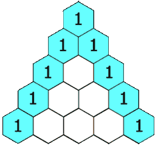

## 118. Pascal's Triangle

Given an integer numRows, return the first numRows of Pascal's triangle.

In Pascal's triangle, each number is the sum of the two numbers directly above it as shown:

Example 1:

Input: numRows = 5

Output: [[1],[1,1],[1,2,1],[1,3,3,1],[1,4,6,4,1]]

---
Example 2:

Input: numRows = 1

Output: [[1]]

---
Constraints:

- 1 <= numRows <= 30

=================================

### Approach:

If we look closely , the triangle could be imagined as lower triangle , which after brief analysis give us the outcome that we have to add a new Arraylist< >( ); for every iteration of i.

And if we put 1 inside it for j = 0 and j = (i)th position and the sum of list(i-1)(j) and list(i-1)(j-1) ob all other indices then we can have the same lower triangle.

| Complexity       | Value              |
| ---------------- |--------------------|
| Time Complexity  | (O(n2)) |
| Space Complexity | (O(n2)) |
