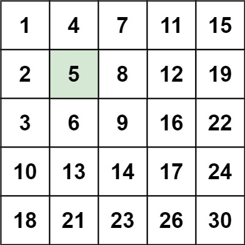

## 240. Search a 2D Matrix II

Write an efficient algorithm that searches for a value target in an m x n integer matrix matrix. This matrix has the following properties:

Integers in each row are sorted in ascending from left to right.
Integers in each column are sorted in ascending from top to bottom.

---

---
Example 1:

Input: matrix = [[1,4,7,11,15],[2,5,8,12,19],[3,6,9,16,22],[10,13,14,17,24],[18,21,23,26,30]], target = 5

Output: true

---
Example 2:

Input: matrix = [[1,4,7,11,15],[2,5,8,12,19],[3,6,9,16,22],[10,13,14,17,24],[18,21,23,26,30]], target = 20

Output: false

---

Constraints:

- m == matrix.length
- n == matrix[i].length
- 1 <= n, m <= 300
- -109 <= matrix[i][j] <= 109
- All the integers in each row are sorted in ascending order.
- All the integers in each column are sorted in ascending order.
- -109 <= target <= 109

===================================

### Approach:

Actually , I have spant a whole 2 hours on this simple question , my approach was that is there any possibility that I can use Binary Search on it . But deep Inside I knew that I won't work cause I am not working on a strictly non-decreasing array.

Then I got the answer and it was pretty simple uet fun.

Just do the contrast from all previous approach and put your variable pointer on top left.

Check it with the target value and if it is grater , then all underneath it will be bigger also , so we will move the pointer to the left.

If it is smaller , then all elements on right will also be smaller , so we move the pointer to down.

We will repeate the process untill the pointer stays inside the matrix or the target is found.

### Time Complexity : O(n2)

### Problem Link : https://leetcode.com/problems/search-a-2d-matrix-ii/description/